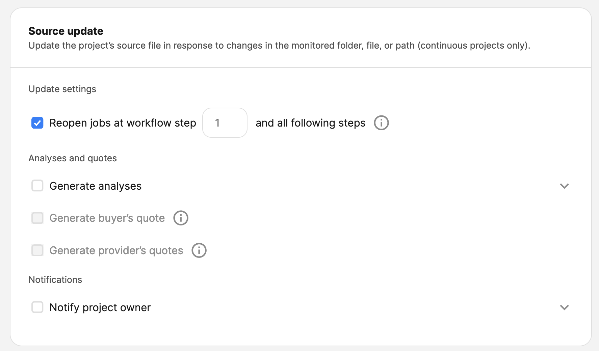
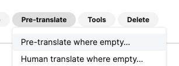

# Prepare Github

* Go to Project -> Settings -> Collaborators and Teams
* Click "Add teams"
	* 
	* Select `bcc-code/phrase-tms-translation`
	* Select `Write` permission
		* Required so that pull requests can be created!

# Phrase

## Access

If you do not have access to Phrase, please contact Reng.

IMPORTANT: You will be granted privileged access to Phrase. With great power comes great responsibility! Please do not change any settings other than what is specified here *especially* not global settings, as you can prevent *all* ongoing translations in BCC.

If you wish to *experiment*, please create a free Phrase trial account! Any changes not specified here need to be cleared with Milenko!!

## Integration

* Check with Milenko what template should be used and how you should name the project
	* Please note that this may require some work on Milenkos side and may not be immediate.
* Update the project name
* 
* Make sure you are in Phrase TMS using the top left corner menu: 
* Go to Settings -> Automated Project Creation -> New
* Select "Create as ... " -> Create a continuous project
* Select the template you agree with Milenko
* Verify that the Source language is correct!
* Under "Monitoring"
	* Select "+ Monitor folder or file"
	* Using the "Github" connector, select the *branch* you want to pull your data from
		* Note: It may be tempting to go deeper, but this will cause you issues with exporting the files again!
	* Monitor subfolder: True
	* Filter by regex: True
		* The regex needs to target the files in your source language.
		* Regex examples
			* `en\.json` - Any `en.json` file anywhere in the repo
			* `(en\.json|en\.resx)` - `en.resx` + `en.json` files anywhere in the repo.
	* Should looks something like 
	* Click "Save"
	* Repeat as needed for each repository
* Under "Translation Export" section (appears above "Monitoring" section after performing the previous step)
	* Select "Add Export"
	* Configure as follows:
	* Click "Save"
* In "Monitor Recurrence" section:
	* Click "Add Monitor"
	* Select "Webhook Based"
	* Copy the webhook url to a safe location (we will use it later)
	* Click "Add"
* The section "Project actions" should be configured as follows: 
* The section "Source update" should be configured as follows: 
* Save
## Github Webhook

* Go to Github -> Your Project -> Webhooks -> New
* Paste in the webhook URL
* Keep all other settings as they are
* Save

## Verify

Go to https://cloud.memsource.com/tms/automatedProjectCreation/list and find the *APC* project you created. It should be marked as "Active", and show "1 Project" in the end of the row like so:

Verify that the there are no errors/warnings and that the project is Active as shown in the picture. If there are issues please contact <TODO>.

Next open the dropdown and select your project:

Validate that jobs have been created like so:

Notify Milenko that the new project is ready!
#  Export settings

By default the files will be exported to `<original folder>/<2 letter language code>.<original extension>`. For example the german translation of the `/this/is/a/folder/blah_en.json` file would be exported to `/this/is/a/folder/de.json`.

The setting for this behaviour are:

"Export online repository files to": `/`
"Add naming rules for completed files": `{path}/{targetLang}`

## Changing export behaviour

Go to https://cloud.memsource.com/tms/automatedProjectCreation/list and find the *APC* project you created. It should be marked as "Active", and show "1 Project" in the end of the row like so:

Open the dropdown and select your project:

Click "Edit" on top right:

Select the "Completed file name and export path". 

Here you can change the behaviour. Additional information about the placeholders can be found at https://support.phrase.com/hc/en-us/articles/5709608269980-Specifying-Completed-File-Names-and-Export-Paths-TMS

For example to get `blah_de.json` you would use:

"Export online repository files to": `/`
"Add naming rules for completed files": `{path}/blah_{targetLang}`
# Importing existing translations

Go to https://cloud.memsource.com/tms/automatedProjectCreation/list and find the *APC* project you created. It should be marked as "Active", and show "1 Project" in the end of the row like so:

Open the dropdown and select your project:

Scroll down to "Translation Memories"

And click "Select"

Keep the settings as they are and click Continue
On the left hand side find "169 - Crowdin Import"

Click the (+) sign on the end of the row.
Make sure the settings on right hand side are now as follows:
 
Click "Save All"
Select all jobs using the checkbox at the top:

Select "Pre-Translate" -> "Pre-translate where empty...."

Set the configuration on next screen as shown here

Click Pre-Translate

Wait a minute or two. After refreshing the page the "confirmed %" column should show > 0% like so:

It is unlikely to reach 100% due to:

* Different split of text
* Different handling of placeholders

